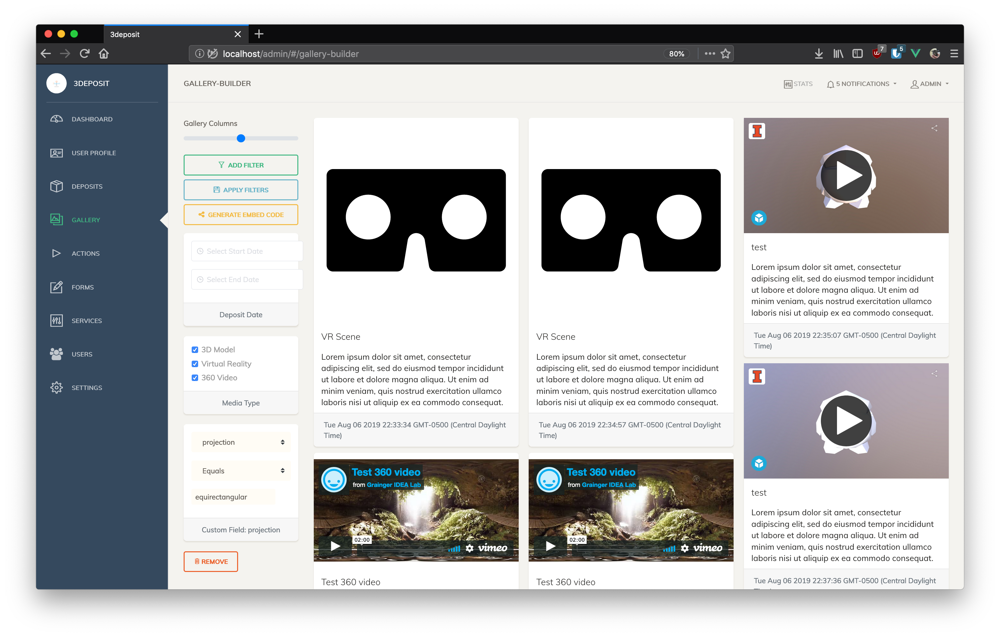
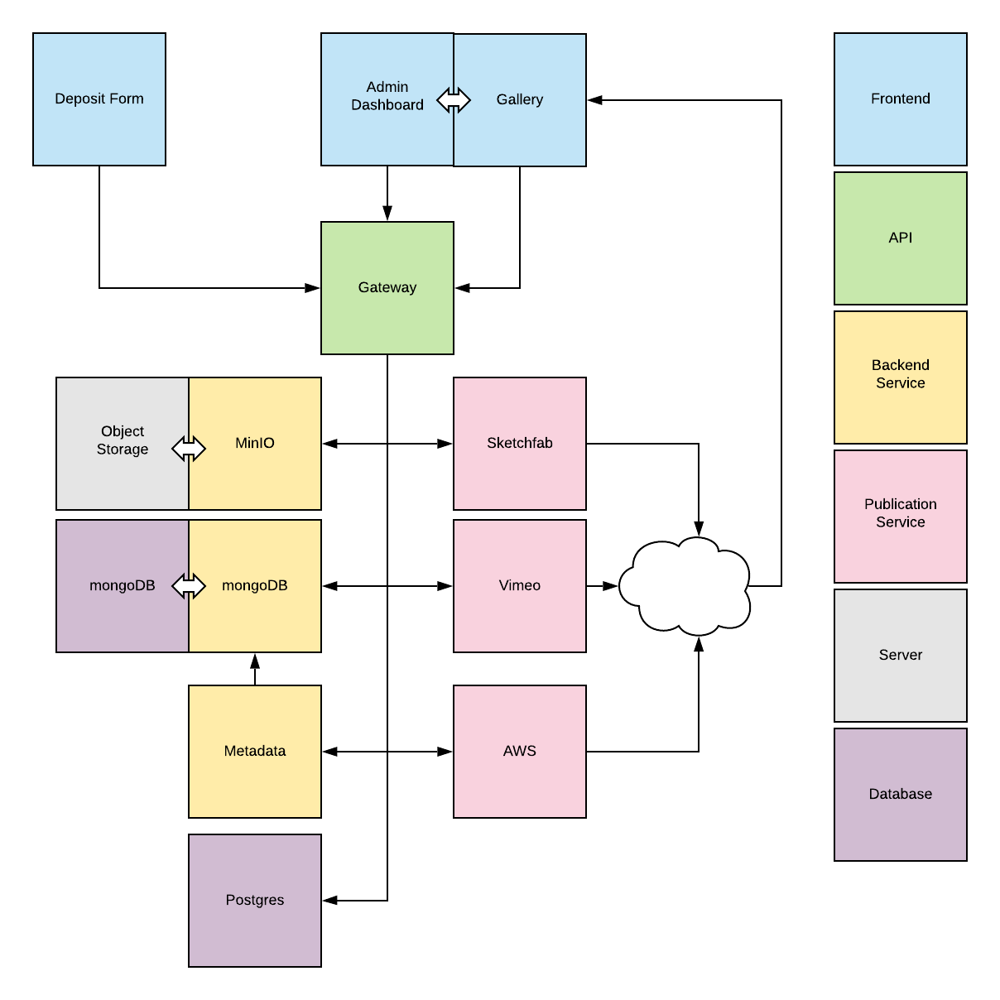

 

3deposit is a 3D-content storage, publication, distribution, & management platform for academic libraries. Key features include a customizable deposit form, automated deposit metadata harvesting, batch deposits, configurable publication endpoints, file integrity checking, and a content 'gallery builder'. 3deposit aims to be extensible, portable, & compatible with existing content preservation systems. Ongoing support and features are planned, including federated content sharing between deployed instances. 



### Storage
By default, 3deposit uses [MinIO](https://github.com/minio/minio) for object storage. Instances can be configured to store objects locally or in a remote bucket. Remote buckets can be self-hosted with a MinIO server or with S3-compatbile providers, such as AWS. 

### Publication
3deposit natively supports three media types:
* 3D models 
* 360 videos
* Virtual Reality applications

Type          | Endpoint
------------- | -------------
3D models     | Sketchfab
360 videos    | Vimeo
VR*           | AWS S3

*Properly configured WebVR applications will be published to static hosting.

Custom services can be added to support additional media types & endpoints.

#### Service Configuration
To use the publication feature, you will need accounts and API keys to authenticate with 3rd party sites. By default, these are Sketchfab, Vimeo, and Amazon S3. Client IDs and API keys for these services should be added to your instance's ```keys.env``` file before deployment. 
```
SKETCHFAB_TOKEN=<TOKEN FROM SKETCHFAB ACCOUNT SETTINGS PAGE>
VIMEO_CLIENT_ID=<ID FROM VIMEO API PAGE>
VIMEO_ACCESS_TOKEN=<TOKEN FROM VIMEO API PAGE>
VIMEO_CLIENT_SECRET=<SECRET FROM VIMEO API PAGE>
AWS_ACCESS_KEY=<KEY FROM AWS SECRETS PAGE>
AWS_SECRET_KEY=<KEY FROM AWS SECRETS PAGE>
AWS_BUCKET_NAME=<NAME OF PUBLIC BUCKET>
```

These values can also be added or changed in the admin dashboard. 

### Deployment
3deposit can be deployed with docker, using the docker-compose file found in the repo.
```
git clone https://github.com/Grainger-Engineering-Library/3deposit.git
cd 3deposit

docker-compose up --build
```

### Data flow


_____

### Acknowledgements
3deposit was developed in Grainger Engineering Library's IDEA Lab, as part of the [Mellon Foundation Immersive Scholar grant](https://www.immersivescholar.org/). In addition to members of the grant cohort, the developers wish to thank the input and guidance from many others at the U of I, including:

* Undergraduate Library
* Media Commons
* CITL
* Library IT
* Engineering IT
* Research Data Services
* School of Information Sciences
* College of Engineering
* Carle Illinois College of Medicine
