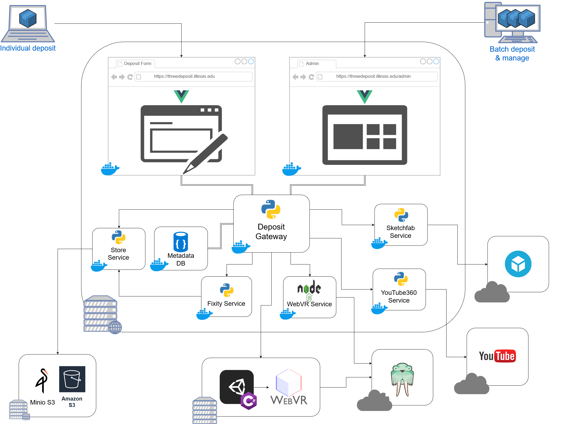

# 3deposit #
3deposit is a 3D content storage & publication platform. Key features include a custom deposit form, automated deposit metadata harvesting, batch deposits, configurable endpoints, file integrity checking, and a content 'gallery builder'. 3deposit aims to be extensible, portable, and compatible with existing content preservation systems. Ongoing support and features are planned. 

## Storage ##
3deposit uses object storage. Instances can be configured to store objects locally or in a remote bucket. Remote buckets can be self-hosted with a MinIO server or with S3-compatbile providers, such as AWS. 

## Publication ##
3deposit natively supports three media types::
* 3D models 
* 360 videos
* Virtual Reality applications

Type          | Endpoint
------------- | -------------
3D models     | Sketchfab
360 videos    | Vimeo
VR*           | AWS S3

*Properly configured WebVR applications will be published to static hosting. There is an experiemental feature to automatically port desktop VR applications to web-embeddable formats. 

Custom services can be added to support additional media types & endpoints. 3deposit's simple API and service SDK makes this a relatively painless affair. 

## Data flow ##
