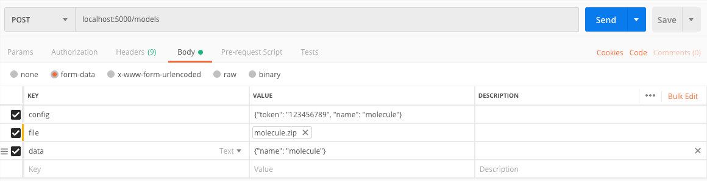

# Sketchfab-service 
Sketchfab-service is a 3D models storage and publication platform based on flask app. It takes in zipped 3D model file, JSON data, and Sketchfab API token and publishes to Sketchfab. After uploading file to Sketchfab, it returns JSON object with two fields, if successful, indicating Sketchfab UID and URI to hosted model location. It can also get details of the 3D model and delete it as per request from the user. 

# Installation 
Open a new terminal in the publish-sketchfab directory.

## Set up virtual environment
pip install pipenv

exit

export FLASK_ENV=development

## Set up Sketchfab-service 
pipenv run python sketchfab-service.py

# Run
Download and open Postman. Then enter request URL localhost:5000/models

## Upload 3D model file

## Get 3D model file information

## Delete 3D model file

